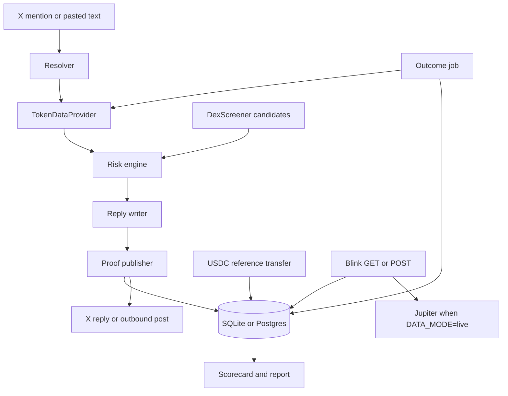

# Architecture

Lens is a TypeScript monorepo. `packages/core` holds the rules and the loop. `packages/db` is the only place that talks to Prisma. `apps/web` is the scorecard and the HTTP API. `apps/worker` polls X.

The model writes sentences. It does not pick LOW / MEDIUM / HIGH, and it has no wallet. Proof is written before any post.

## Components

| Piece | Where | Role |
| --- | --- | --- |
| Token resolver | `packages/core/src/resolver.ts` | Pulls a base58 mint (32–44 chars) or a `$ticker` out of post text. A mint wins over a ticker. Program ids are ignored. |
| Token data provider | `packages/core/src/providers` | `TokenDataProvider`: `resolveBySymbol`, `getToken`, `getPrice`. `MockTokenDataProvider` and `LiveTokenDataProvider`. |
| Risk engine | `packages/core/src/risk/engine.ts` | Pure function. No network, no model. |
| Reply writer | `packages/core/src/reply` | Template, or an OpenAI-compatible chat call. `enforceReplyPolicy` runs on both. |
| Proof publisher | `packages/core/src/proof` | Hash, memo payload, mock store, Solana memo transaction, verify. |
| X client | `packages/core/src/x` and `apps/worker/src/x-live.ts` | `XClient` interface, including `sendDm`. Mock is the default. Live uses `twitter-api-v2` with OAuth 1.0a or OAuth 2.0 user context, and is constructed only by the worker. |
| Store | `packages/core/src/store/types.ts`, Prisma in `packages/db` | Mentions, checks, proofs, outcomes, accounts, watches, payments, alerts, outbound cap, mock memos, poll cursor. |
| Pipeline | `packages/core/src/pipeline.ts` | Mention handling, manual checks, outbound posts, daily cap. |
| Pro billing | `packages/core/src/billing` | Solana Pay reference transfer. `PaymentRail` is the seam for a future card provider. |
| Alerts | `packages/core/src/alerts.ts` | DM Pro watchers when a check is HIGH. |
| Discovery | `packages/core/src/discover.ts` | DexScreener token profiles and boosts. |
| Outcome job | `packages/core/src/outcomes.ts` | Price change after N days. |
| Scorecard | `apps/web` | Server-rendered record, report page, check form, verify form. |
| Blink | `packages/core/src/blink.ts` and `apps/web/app/api/actions/trade/[mint]` | Solana Action. Jupiter swap builder is separate. |

## Data flow



Order inside `createRiskCheck`:

1. Resolve the mint, or use the mint that was passed in.
2. Load a `TokenSnapshot`.
3. Read burned/locked claims from the parent post when there is one, otherwise from the text the user pasted.
4. `evaluateRisk` chooses the level.
5. The writer produces the exact reply. By default that text has no URL and ends with “Full report on our scorecard.” Set `X_REPLY_LINKS=true` to include `Report: <url>` again.
6. SHA-256 that string, build `lens:v1|<time>|<hash>`, publish the memo.
7. Only after the publish succeeds, save the check. Callers post to X after that.

If the proof fails, nothing is posted and nothing is saved as a published check. A failed X post is still stored, with status `reply_failed`, because the proof already exists.

`processMention` adds, around that core:

- Skip mentions already in a terminal state (`replied`, `reply_failed`, `rate_limited`).
- Per-user daily cap, checked before a new proof. The counter increments only after a successful reply.
- Dedupe on parent post id + mint. A second tag on the same post gets the same proved text and does not write a second memo.
- If no token is found, a short notice is still proved and posted. It is kind `unresolved` and is left out of win rate.

Outbound posts (`publishOutbound`, `npm run post`) use kind `auto`: HIGH becomes `warning`, LOW becomes `call`, anything else becomes `note`. Win rate counts `call` only.

## Data model

Prisma (`prisma/schema.prisma`). The default provider is SQLite. A `postgresql://` URL uses a generated copy of the same models.

- **Mention** — one X post that tagged the bot, plus status and the check it produced.
- **Check** — the risk record: kind, mint, level, facts JSON, snapshot JSON, reply text, price at check time, data mode (`mock` or `live`).
- **Proof** — hash, ISO time, exact memo payload, signature, cluster (`mock`, `devnet`, or `mainnet-beta`).
- **Outcome** — later price, percent change, `labelCorrect`, `callResult`, and the window that was used.
- **Reply** — the X reply id for a mention. Cached replies point at the original check.
- **UsageDay** — `user + UTC day` counter.
- **ChainMemo** — payload for mock signatures, so the web process can verify what the demo wrote.
- **BotCursor** — last mention id the poller handled.
- **Account** — X handle, X user id, and/or wallet. `proUntil` is the paid period. Table name is `accounts` so Postgres does not collide with `USER`.
- **Watch** — mint on an account's watchlist.
- **Payment** — pending or paid USDC checkout, including the Solana Pay reference.
- **Alert** — DM text for one user and one check. `queued` until an X user id exists, then `sent` or `failed`.
- **OutboundDay** — how many calls and warnings were posted that UTC day.
- **XOAuth2Token** — the current OAuth 2.0 access token, refresh token, and expiry. One row, id `oauth2`. A copy is also written to `data/x-oauth2.json`, which is gitignored. The newer `updatedAt` wins if the two copies differ.

`MemoryStore` implements the same interface for tests.

## Provider interface

```ts
interface TokenDataProvider {
  readonly name: string;
  resolveBySymbol(symbol: string): Promise<{ mint; symbol; name } | null>;
  getToken(mint: string): Promise<TokenSnapshot | null>;
  getPrice(mint: string): Promise<number | null>;
}
```

`TokenSnapshot` is the only object the rules see: age, liquidity, lock, top-10 share, creator sold percent, creator balance percent, mint authority, freeze authority, sniper percent, burned percent, and source links.

**Mock.** Three fixtures, `$DANGER`, `$SAFE`, and `$MID`, plus a deterministic synthetic profile for any other mint so the demo form always returns something. Unknown mints are labeled synthetic and `dataMode` is `mock`. The report page says so. `setPrice` lets the outcome job move the price without another check.

**Live** (`LiveTokenDataProvider`), in parallel:

- DexScreener for symbol, price, liquidity, and the earliest pool time in the response. No key.
- Solana JSON-RPC (`getAccountInfo`, `getTokenLargestAccounts`, `getMultipleAccounts`) for mint layout, freeze authority, supply, top holders, and incinerator burn balance. `DATA_RPC_URL`, or Helius when `HELIUS_API_KEY` is set, otherwise the public mainnet endpoint.
- RugCheck’s public report for holder list fallback, insider-network percent (used as the sniper figure), creator balance, and LP lock.
- Birdeye `token_security` only when `BIRDEYE_API_KEY` is set. That is the path that can fill `creatorSoldPct`.
- Jupiter price v3 if DexScreener has no price. `getPrice` for the outcome job prefers Jupiter, then DexScreener, so scoring does not re-download a full report.

Chain fields override RugCheck for authorities and for top-10 when the RPC read succeeds. A failed source is skipped. The check is then scored with `unknown` on the missing fields. Four or more unknowns stop a token from being labeled LOW.

Lock heuristic (`interpretLpLock`): a majority of liquidity locked, or a classic LP token at least 80% locked, is locked. A classic LP with almost nothing locked is unlocked. Concentrated-liquidity pools (no LP mint) with sizeable liquidity stay `unknown`, because “unlocked” would be the wrong fact. Expired locker dates are ignored.

Known stake-pool mints in `risk/stake-pools.ts` (JitoSOL, mSOL, bSOL, jupSOL, INF) keep an enabled mint authority from counting as danger. The fact short text is “Stake-pool token.” The same waiver applies when the mint authority pubkey is the SPL, Marinade, or Sanctum stake-pool program. Matching is by mint address, not by symbol.

## Reply writer

`createReplyWriter` returns the template when `LLM_MODE=template` or no API key is set. Otherwise it calls `POST {LLM_BASE_URL}/chat/completions` with a system prompt that forbids new facts, buy/sell advice, and accusations. The response is dropped if it contains a different risk level, still says “scam” after replacement, or runs past 500 characters. The template is the fallback.

The template tries to stay within 280 characters: header, the sharpest short facts that fit, then either “Full report on our scorecard.” or the report URL when `X_REPLY_LINKS=true`, then the disclaimer. `enforceReplyPolicy` strips `http`/`https`, `t.co`, and bare domains when links are off, and does not put the report URL back. The same flag covers outbound posts and warning DMs. Blinks still link to the report.

## Proof

`hashReply` is SHA-256 over the UTF-8 bytes of the exact reply.

`buildProofPayload` produces `lens:v1|<ISO time>|<hash>`. Two proofs of the same text at different times share a hash and differ in the memo.

`PROOF_MODE=mock` writes the memo to `ChainMemo` and returns a `mock_` signature. Verify reads that row. It is tamper-evident inside this database. It is not a Solana transaction. The UI says so.

`PROOF_MODE=solana` builds a legacy transaction with one memo instruction, signed by `SOLANA_KEYPAIR` or the file at `SOLANA_KEYPAIR_PATH`, and sends it to `SOLANA_RPC_URL` (devnet by default). Verify loads the transaction and reads memo instruction data, then log lines. If the chain time and the memo time differ by more than 30 minutes, verify fails. Mock signatures still verify from the database when you are in solana mode, so old demo rows keep working.

Token data is mainnet. Proofs are whichever cluster `SOLANA_CLUSTER` selects. Those are different networks on purpose.

## X bot

`pollOnce` lists mentions after the stored cursor, oldest first, runs `processMention`, then advances the cursor even if one mention fails, so a single bad tweet cannot block the queue. It then runs `runOutboundCycle`, flushes queued DMs, and the outcome job. The worker repeats this every `POLL_INTERVAL_MS` (default 180 seconds).

The live client resolves the bot user id once, when it is constructed. `X_BOT_USER_ID` wins. Otherwise Lens reads the `x_bot_user_id` cursor, and only if that is empty calls `GET /2/users/me`, saves the id, and logs `Set X_BOT_USER_ID=...`. Mention polls reuse the in-memory id.

Free mentions stop at `RATE_LIMIT_PER_USER_PER_DAY`. A user is Pro when `proUntil` is in the future. Pro is set only by `confirmUsdcCheckout` after a matching USDC balance increase on the treasury, with the checkout reference present in the transaction account keys. The counter is not incremented for Pro.

`MAX_X_REPLIES_PER_DAY` (default 50) is a separate counter for the bot, stored as a `UsageDay` row with id `lens:x_replies`. When it is reached, the worker does not prove or reply. Pro does not bypass it. Outbound posts still use `OUTBOUND_DAILY_CAP`.

`npm run doctor` prints a ready / not-ready list and does not post. `npm run doctor -- --x` adds one `GET /2/users/me`. That flag does not refresh OAuth tokens.

`runOutboundCycle` does nothing unless `OUTBOUND_ENABLED=true`. It posts configured mints first, then DexScreener candidates when `OUTBOUND_DISCOVER=true`. Discovered MEDIUM tokens are not posted. Each successful post counts toward `OUTBOUND_DAILY_CAP`. A mint with a call, warning, or note in the last 20 hours is skipped.

`X_AUTH_MODE=oauth1` (the default) uses OAuth 1.0a user tokens. `X_AUTH_MODE=oauth2` uses a confidential OAuth 2.0 user: client id, client secret, access token, and refresh token. Access tokens expire after two hours. Before a user-context call, and again after an HTTP 401, Lens posts `grant_type=refresh_token` to `https://api.x.com/2/oauth2/token` and saves the rotated refresh token in `XOAuth2Token` and `data/x-oauth2.json`. A saved row is preferred over the env refresh token, because X invalidates the previous refresh token. `npm run x:oauth2-login` runs the PKCE authorize flow on `http://127.0.0.1:4391/callback` when the refresh token is lost.

`X_BEARER_TOKEN`, when set, is used only to read a parent post. App-only bearer auth cannot post a reply or a DM. The web app does not construct the live client. Manual checks never post to X. Live DMs call `v2.sendDmToParticipant` and fail closed if X rejects them. Tests use `MockXClient.dms` and a fake token endpoint. They do not call X.

HTTP 429 and dropped connections retry with exponential backoff (`withRetry`, default 4 attempts). If `getTokenLargestAccounts` still fails, the mint and freeze authorities from `getAccountInfo` are kept and holder stats fall through to RugCheck.

## Blink

`GET /api/actions/trade/:mint` reuses a check for that mint from the last 15 minutes, or creates a `blink` check (which is proved). HIGH risk returns `disabled: true`, no `transaction` action, and a report link. POST of a HIGH token returns 403 and does not ask Jupiter for a swap.

Other levels return buy actions for 0.1, 0.5, and 1 SOL plus a custom amount. POST calls Jupiter at `JUPITER_BASE_URL` (default `https://api.jup.ag`) on `/swap/v1/quote` and `/swap/v1/swap`, and returns the base64 transaction. Price reads use `/price/v3` on the same host. Those paths did not change when `lite-api.jup.ag` started shutting down. Keyless requests work. `JUPITER_API_KEY`, when set, is sent as `x-api-key`. In mock data mode the swap builder returns an error string instead of a fake transaction, so a wallet is not asked to sign garbage. `JUPITER_FEE_BPS` (default 50) is sent only when `JUPITER_FEE_ACCOUNT` is set.

`/actions.json` maps `/api/actions/**`.

## Scoring

`judgeOutcome` is pure.

- Call: `win` if change ≥ `CALL_WIN_PCT`, `loss` if change ≤ the negative of that, otherwise `flat`.
- Warning: `correct` if change ≤ `SHARP_DROP_PCT`, else `incorrect`.
- HIGH label: correct if change ≤ `SHARP_DROP_PCT`.
- LOW label: correct if change is above that.
- MEDIUM: `labelCorrect` is null.
- Missing price at check time is stored as `unscored`. A failed price lookup is left unscored so the next job can retry.

`scoreDueChecks` selects rows with `createdAt` at or before `now - windowDays`. The demo passes `windowDays: 0`.

## Decisions

- **SQLite by default, Postgres when `DATABASE_URL` starts with `postgres`.** `scripts/prepare-schema.mjs` copies the schema with `provider = "postgresql"` and the entrypoint generates the client. Local demo stays on the SQLite file. Do not commit `prisma/.generated`.
- **Memo program, not Anchor.** The requirement is a public hash and time. A memo is one instruction, easy to verify from any explorer, and does not need a deployed program id. An Anchor program would help if we later wanted indexed accounts or a fee. It is not needed to prove a string.
- **Rules before the model.** The PRD calls out prompt-injection against the reply bot. The model never sees a tool and its text is rejected if the level changes.
- **Devnet proofs, mainnet facts.** Writing memos on mainnet costs real SOL and is the wrong default for a hackathon wallet. Reading devnet token data would score fake mints. The split is explicit in config.
- **RugCheck next to RPC.** Helius, DexScreener, Birdeye, and Jupiter are the named sources. RugCheck is an extra public report used for lock status and insider clusters, behind the same provider, and it is skipped when it fails. Birdeye stays optional because it needs a key.
- **Do not punish missing data as danger, and do not call it a clean LOW.** Unknown is a third state. Too many unknowns become MEDIUM.
- **Mock fixtures are obvious.** The scorecard banner and the report page say when the facts are not from mainnet.

## What is intentionally out

Browser extension, influencer scores, and trading user funds. Card checkout is an interface only. See `docs/STATUS.md`.
